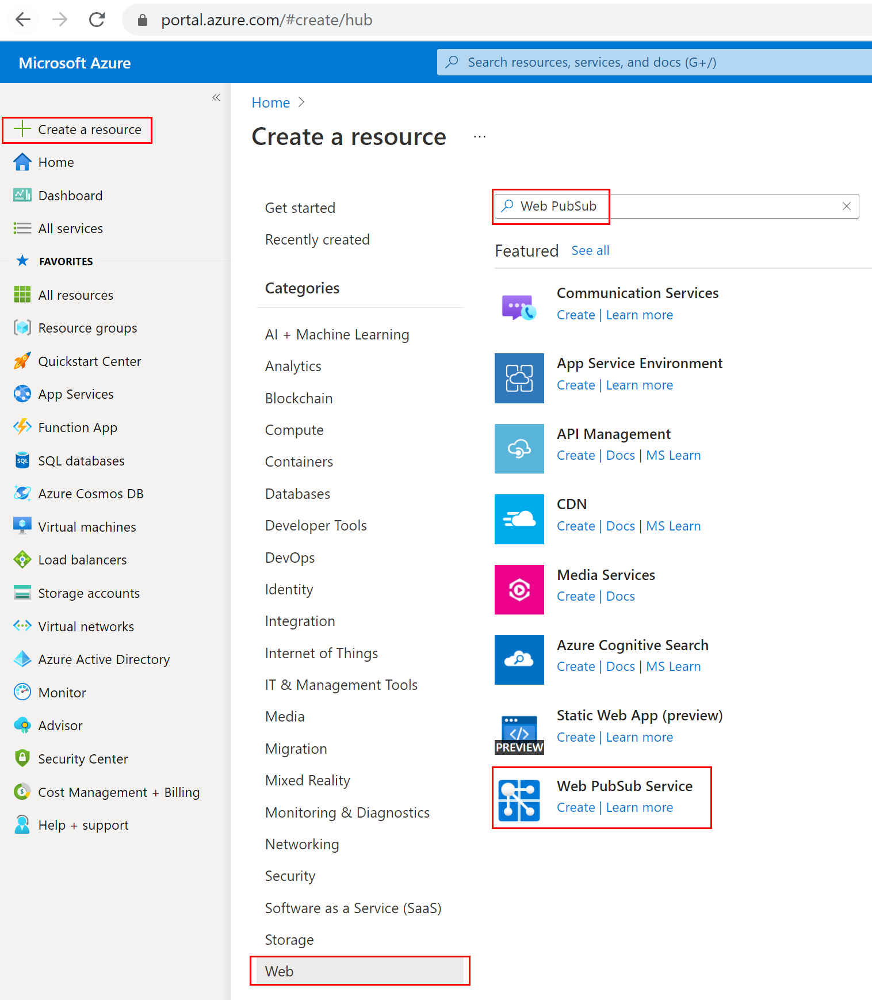
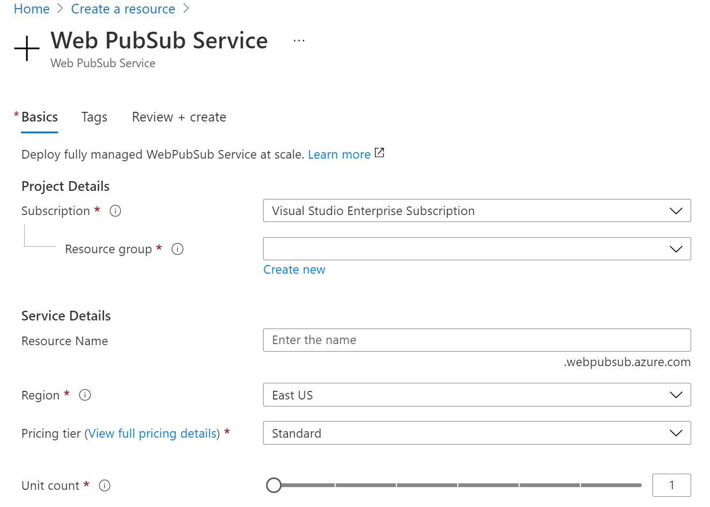
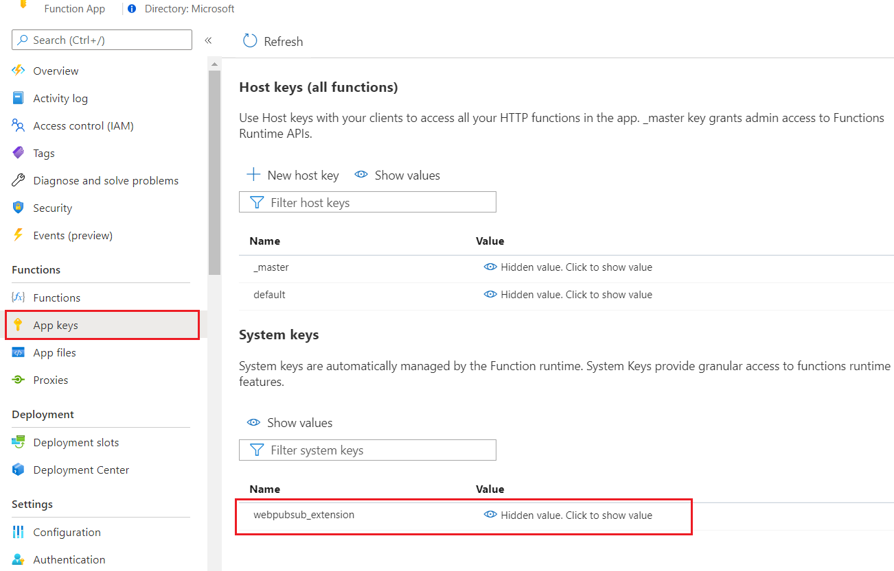
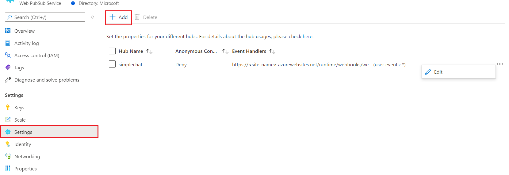
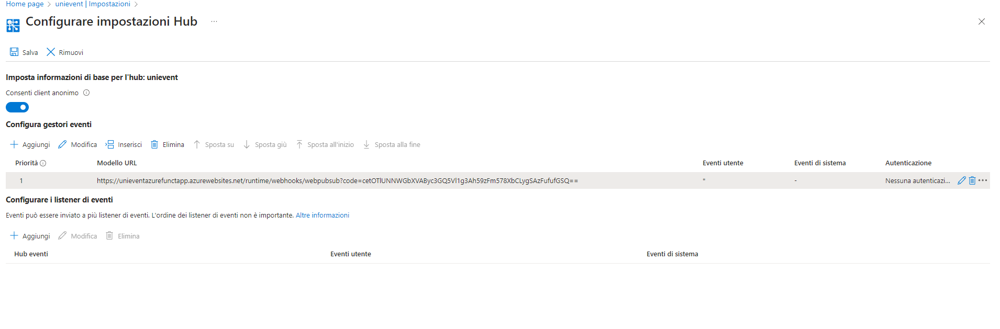

Per far funzionare il websocket seguire i seguenti passaggi

Create an Azure Web PubSub service instance
Your application will connect to a Web PubSub service instance in Azure.

Select the New button found on the upper left-hand corner of the Azure portal. In the New screen, type Web PubSub in the search box and press enter. (You could also search the Azure Web PubSub from the Web category.)

Screenshot of searching the Azure Web PubSub in portal.

Select Web PubSub from the search results, then select Create.

Enter the following settings.

Select Create to start deploying the Web PubSub service instance.
 
 
 
<b>Deployare questa azure function</b>

az login --tenant 5f0b3e27-d6d7-48e5-982d-c508ad4eec62 (accedere con account alodato815@gmail.com)
Creare un nuovo azure function project in azure (piano gratuito)

https://portal.azure.com/#view/Microsoft_Azure_Billing/FreeServicesBlade
 

func azure functionapp publish UniEventAzureFunctApp --resource-group unievent --python --publish-local-settings --no-bundler --force --functions ChatWebSocket

per deployarle tutte invece
func azure functionapp publish UniEventAzureFunctApp --resource-group unievent --python --publish-local-settings --no-bundler --force

[FONDAMENTALE] 
 
 
Go to Azure portal -> Find your Function App resource -> App keys -> System keys -> webpubsub_extension. Copy out the value as <APP_KEY>.

Set Event Handler in Azure Web PubSub service. Go to Azure portal -> Find your Web PubSub resource -> Settings. Add a new hub settings mapping to the one function in use. Replace the <FUNCTIONAPP_NAME> and <APP_KEY> to yours.

Hub Name: simplechat
URL Template: https://<FUNCTIONAPP_NAME>.azurewebsites.net/runtime/webhooks/webpubsub?code=<APP_KEY>
User Event Pattern: *
System Events: -(No need to configure in this sample)

esempio:
 
https://unieventazurefunctapp.azurewebsites.net/runtime/webhooks/webpubsub?code=cetOTlUNNWGbXVAByc3GQ5Vl1g3Ah59zFm578XbCLygSAzFufufGSQ==

Per ulteriori info vedi questo tutorial:
 
https://learn.microsoft.com/en-us/azure/azure-web-pubsub/quickstart-serverless?tabs=python

testarla con questa estensione di chrome se necessario (abilitarla)
chrome-extension://fgponpodhbmadfljofbimhhlengambbn/index.html